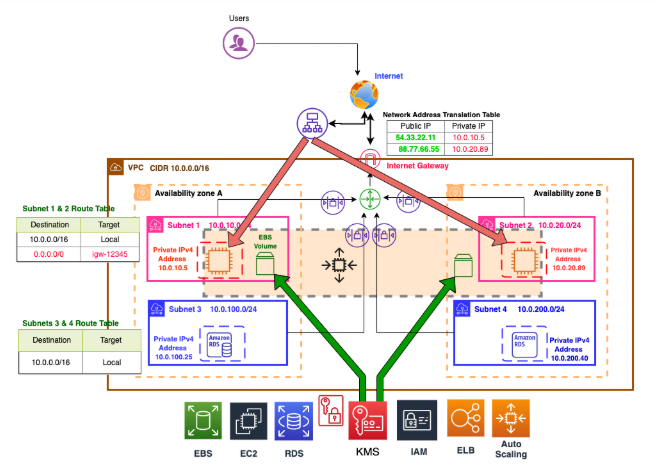

# AWS Infrastructure Automation with Boto3

> Automated provisioning of a production-grade, multi-AZ AWS infrastructure using Python and the Boto3 SDK — covering networking, compute, load balancing, auto scaling, and managed databases.

---

## Architecture Overview

This project programmatically builds a complete AWS environment from scratch — no manual console clicks required. The infrastructure follows AWS Well-Architected Framework principles: public/private subnet isolation, high availability across two Availability Zones, encrypted storage, and least-privilege security group rules.

## Architecture Overview




**Traffic Flow:** `Users → ALB (public subnets) → EC2 Instances (private subnets) → RDS Multi-AZ (private subnets)`

---

## AWS Services Used

| Service | Role |
|---------|------|
| **EC2** | Web application servers in private subnets |
| **VPC / Subnets** | Network isolation (public + private, 2 AZs) |
| **Internet Gateway** | Inbound internet access to public subnets |
| **NAT Gateway** | Outbound internet for private subnet instances |
| **ALB (Application Load Balancer)** | HTTP traffic distribution across EC2 targets |
| **Auto Scaling Group** | Dynamic scaling of EC2 instances (min 1, max 3) |
| **RDS MySQL (Multi-AZ)** | Managed relational database with failover |
| **Security Groups** | Layered firewall rules (WebSG, ALBSG, DB_SG) |
| **EBS** | Encrypted gp2 root volumes for EC2 instances |

---

## Infrastructure Provisioning Steps

The script executes the following 26 steps in sequence:

### 1. Networking Foundation
1. **Create VPC** — CIDR `10.0.0.0/16`
2. **Create public subnets** — `10.0.10.0/24` (us-east-1a) and `10.0.20.0/24` (us-east-1b)
3. **Enable auto-assign public IP** on public subnets
4. **Create private subnets** — `10.0.100.0/24` and `10.0.200.0/24`
5. **Create Internet Gateway** and attach to VPC
6. **Create public route table** — default route `0.0.0.0/0 → IGW`; associate both public subnets
7. **Allocate Elastic IP** and create **NAT Gateway** in the first public subnet
8. **Create private route table** — default route `0.0.0.0/0 → NAT GW`; associate both private subnets
9. **Wait for NAT Gateway** to reach `available` state before proceeding

### 2. Security Groups
10. **WebSG** — Ingress: TCP 22 (SSH), 80 (HTTP), 443 (HTTPS) from `0.0.0.0/0`; Egress: all TCP outbound
11. **ALBSG** — Ingress: TCP 80 from `0.0.0.0/0`; Egress: TCP 80 → WebSG only
12. **DB_SG** — Ingress: all traffic from WebSG only (no public access)

### 3. Compute
13. **Launch 2 EC2 instances** (t2.micro, Amazon Linux 2) — one per private subnet; each bootstrapped via User Data to install Apache HTTPD and serve a custom HTML page
14. **Wait for instances** to reach `running` state
15. **Encrypted EBS** root volumes (8 GB, gp2, `DeleteOnTermination: true`)

### 4. Load Balancing & Auto Scaling
16. **Create Target Group** (`webTG`) — HTTP:80 with health checks
17. **Register EC2 instances** as targets
18. **Create Application Load Balancer** (`DolfinedLoadBalancer`) — internet-facing, across both public subnets
19. **Wait for ALB** to reach `active` state
20. **Create HTTP Listener** on port 80 → forward to `webTG`
21. **Create Launch Configuration** (mirrors EC2 spec: same AMI, instance type, WebSG)
22. **Create Auto Scaling Group** (`DolfinedScalingGroup`) — min 1, max 3, desired 1, across both AZs

### 5. Database
23. **Create DB Subnet Group** using both private subnets
24. **Launch Multi-AZ RDS MySQL** (`DolfinedDBInstance`) — `db.t2.micro`, 10 GB, admin credentials
25. **Wait for RDS** to reach `available` state

---

## Security Design

| Layer | Rule | Rationale |
|-------|------|-----------|
| ALB → EC2 | ALBSG egress only to WebSG | Limits ALB outbound scope |
| Internet → EC2 | No direct route (private subnet) | Instances are never directly reachable from internet |
| EC2 → Internet | Via NAT Gateway only | Controlled outbound for updates/patches |
| EC2 → RDS | DB_SG allows inbound from WebSG only | Database never exposed publicly |
| EBS Volumes | `Encrypted: True` | Data at rest protection |

---

## Prerequisites

- Python 3.8+
- Boto3 (`pip install boto3`)
- AWS CLI configured with a named profile `dev_admin` (admin privileges)
- An existing **EC2 Key Pair** named `MyKey` in `us-east-1`
- IAM permissions for: EC2, ELB, Auto Scaling, RDS

```bash
pip install boto3
aws configure --profile dev_admin
```

---

## Usage

```bash
# Clone the repository
git clone https://github.com/<your-username>/aws-infrastructure-boto3.git
cd aws-infrastructure-boto3

# Install dependencies
pip install boto3

# Run the provisioning script
python infrastructure.py
```

The script prints the ID/ARN of every resource created and waits on long-running operations (NAT Gateway, EC2 instances, ALB, RDS) before proceeding. Expected total run time: **10–15 minutes** (dominated by NAT Gateway and RDS startup).

---

## Configuration

Customize these variables at the top of `infrastructure.py` before running:

| Variable | Default | Description |
|----------|---------|-------------|
| `profile_name` | `dev_admin` | AWS CLI profile with admin rights |
| `region_name` | `us-east-1` | Target AWS region |
| `public_subnet_cidrs` | `10.0.10.0/24`, `10.0.20.0/24` | Public subnet CIDRs |
| `private_subnet_cidrs` | `10.0.100.0/24`, `10.0.200.0/24` | Private subnet CIDRs |
| `ImageId` | `ami-0889a44b331db0194` | Amazon Linux 2 AMI (us-east-1 specific) |
| `KeyName` | `MyKey` | EC2 Key Pair name |
| `MasterUsername` | `admin` | RDS master username |
| `MasterUserPassword` | `dolfineddb` | RDS master password ⚠️ Change before use |

> ⚠️ **Security Note:** Do not commit real credentials or passwords to version control. Use environment variables or AWS Secrets Manager in production.

---

## Cost Awareness

> Running this stack incurs AWS charges. Key billable resources:

- NAT Gateway: ~$0.045/hr + data transfer
- EC2 t2.micro: Free Tier eligible (750 hrs/month)
- RDS db.t2.micro Multi-AZ: ~$0.048/hr
- ALB: ~$0.008/hr + LCU charges

**Always tear down resources after testing** to avoid unexpected charges. A cleanup/teardown script is recommended (not included — contributions welcome).

---

## Project Structure

```
aws-infrastructure-boto3/
├── infrastructure.py      # Main provisioning script
└── README.md              # This file
```

---

## Tech Stack


---

## Author

**Mustafa Kanaan** — DevOps & Cloud Engineer
